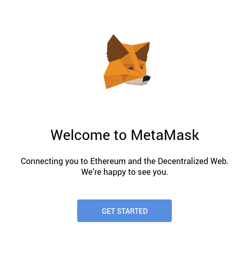
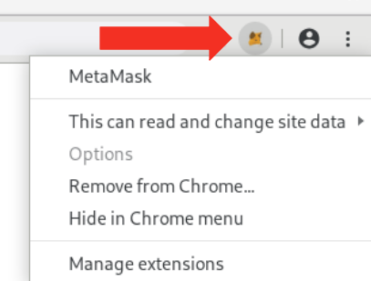
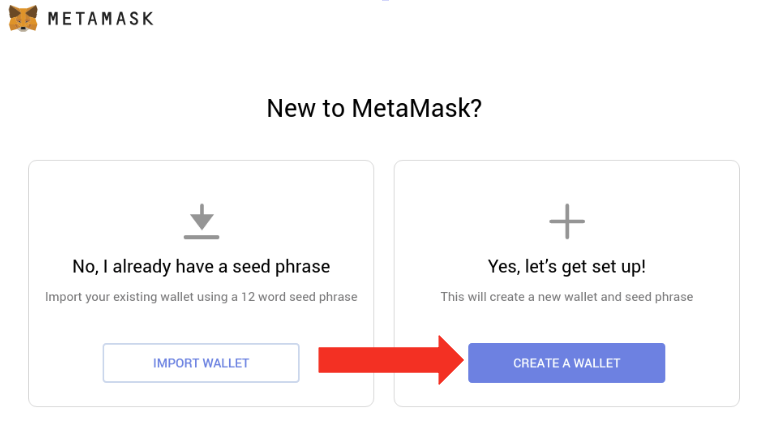
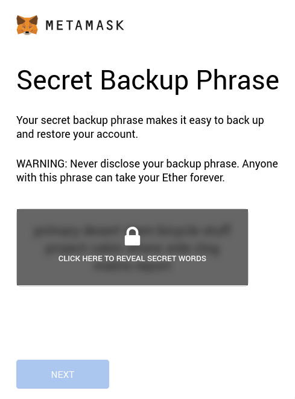
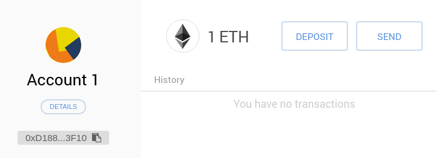

This is the first post of a series from [Solidity By Example](https://solidity-by-example.org),
where we learn how to program smart contracts using [Solidity](https://solidity.readthedocs.io).

Interacting with smart contracts on the Ethereum blockchain costs Ether
so we need a wallet. Let's install [MetaMask](https://metamask.io).

## Setting up MetaMask

---

First install [MetaMask](https://metamask.io). You
should see something like this.

In the top right corner or your browser you should also see a fox icon.

Click `CREATE A WALLET` and then type your password.

**Important** Backup your secret words in a safe and secret
place. Anyone with this secret words can steal your Ether.

Congratulations! You have successfully setup MetaMask.

## Get Ether from Test Network

---

Now let's get some free Ether available on the test network. Switch
networks to _Ropsten Test Network_.

Click `DEPOSIT`

Next click `GET ETHER`

Click `request 1 ether from faucet` and wait a few minutes.
You should see a link to the transaction and your wallet should now have
1 Ether.

## Recap

---

[MetaMask](https://metamask.io) is an Ethereum wallet that will enable us to deploy and interact with smart contracts on the blockchain.  
We learned how to install [MetaMask](https://metamask.io) and fund our wallet with some free Ether available on _Ropsten_ test network.
