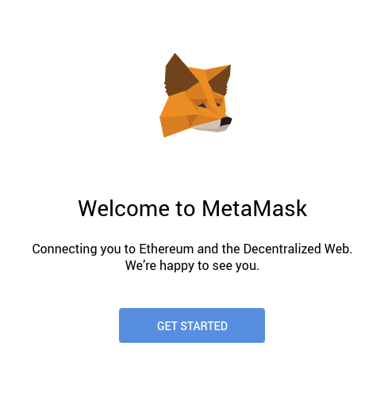
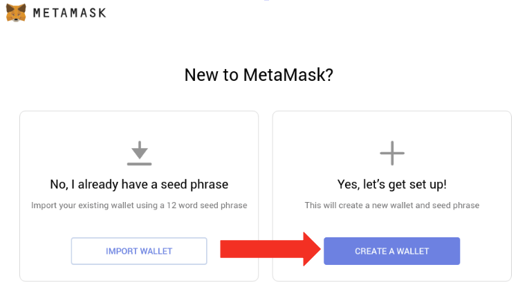
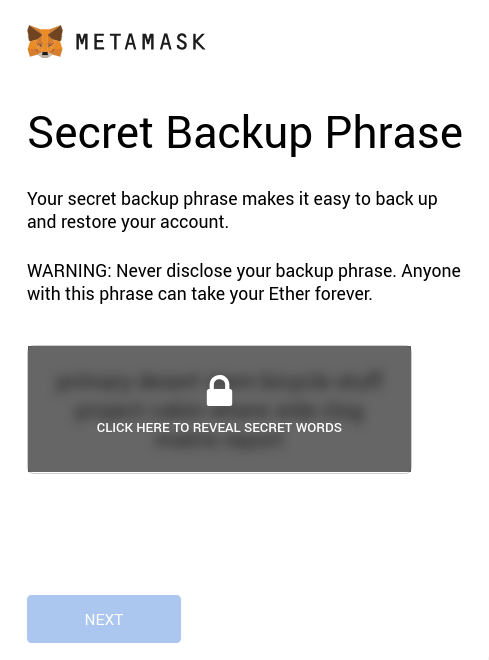
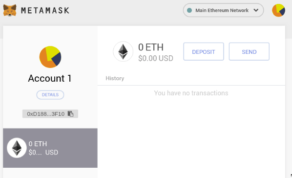
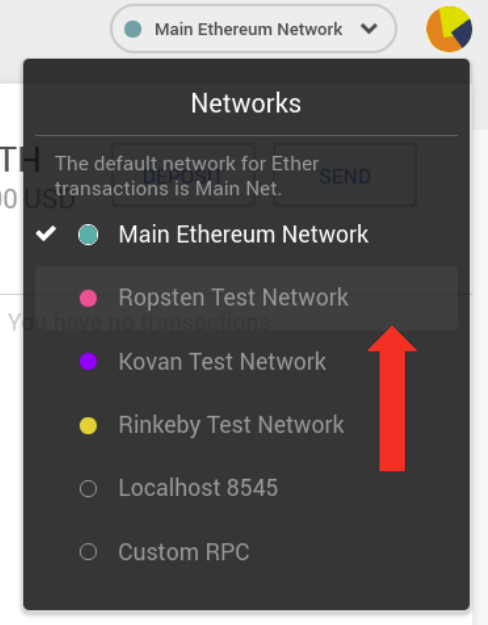
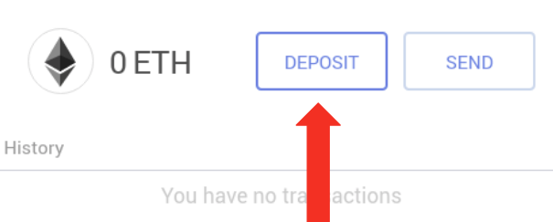
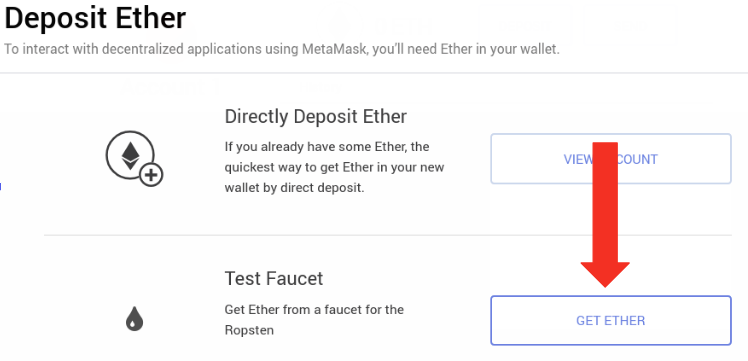
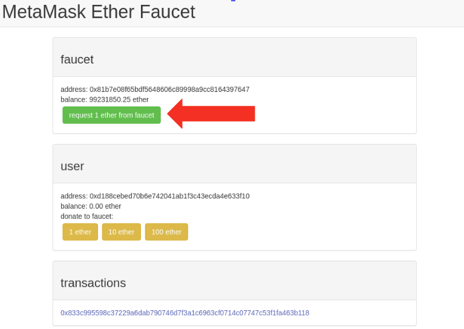
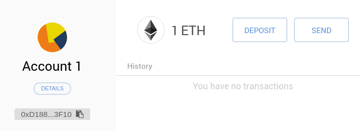

これは [Solidity By Example](https://solidity-by-example.org) からのシリーズの最初の投稿です。
[Solidity](https://solidity.readthedocs.io) を使ってスマートコントラクトのプログラミングを一緒に学びましょう。

Ethereum のブロックチェーンでスマートコントラクトを動かすのに Ether が必要です。
イーサリアムのウォレット [MetaMask](https://metamask.io) をインストールしましょう。

## MetaMask (メタマスク) の設定

---

まずはじめに [MetaMask](https://metamask.io) をインストールしてください。

ブラウザ右上にメタマスクのアイコンが表示されます。

`CREATE A WALLET`をクリックしてパスワードを入力してください。

**重要** 12 の英単語（シード）をバックアップしてください。

おめでとうございます。これで MetaMask のセットアップは完了です。

## テストネットワークから Ether の入手

---

それでは、テストネットワークで無料の Ether を入手しましょう。_Ropsten Test Network_ を選択してください。

`DEPOSIT`をクリックしてください。

次に `GET ETHER` をクリックしてください。

`request 1 ether from faucet`をクリックして、数分待ちます。
トランザクションへのリンクが表示され、ウォレットに Ether が追加されます。

## まとめ

---

[MetaMask](https://metamask.io) は Ethereum のウォレットで、ブロックチェーン上のスマートコントラクトとやり取りすることができます。  
[MetaMask](https://metamask.io) のインストール、_Ropsten_ テストネットワークからの Ether の入手方法を紹介いたしました。
